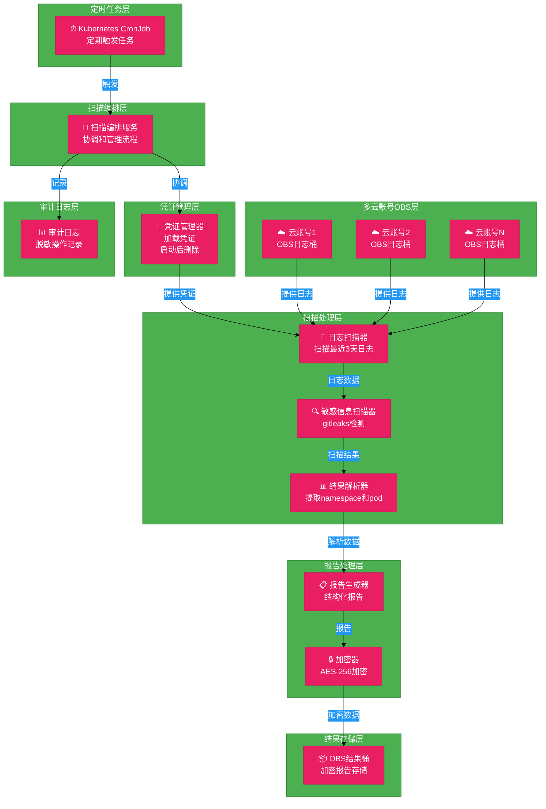
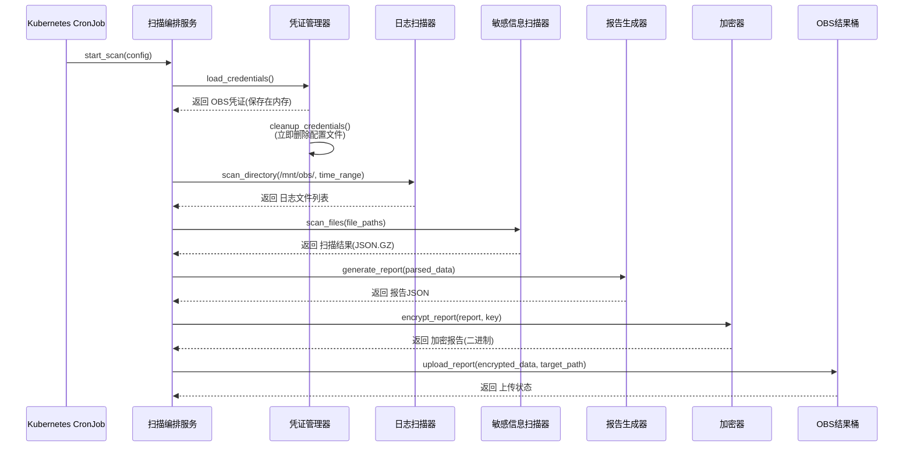
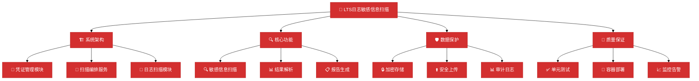
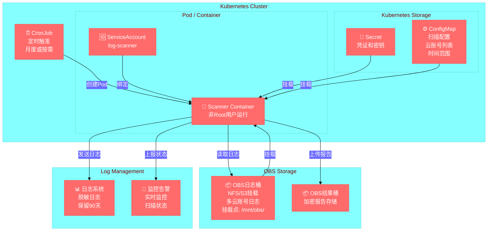
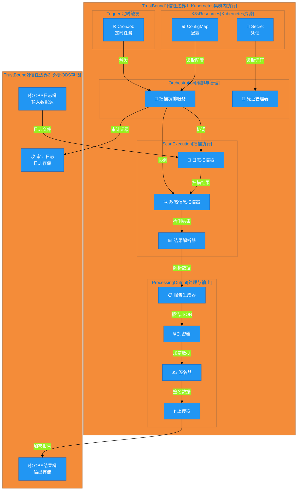
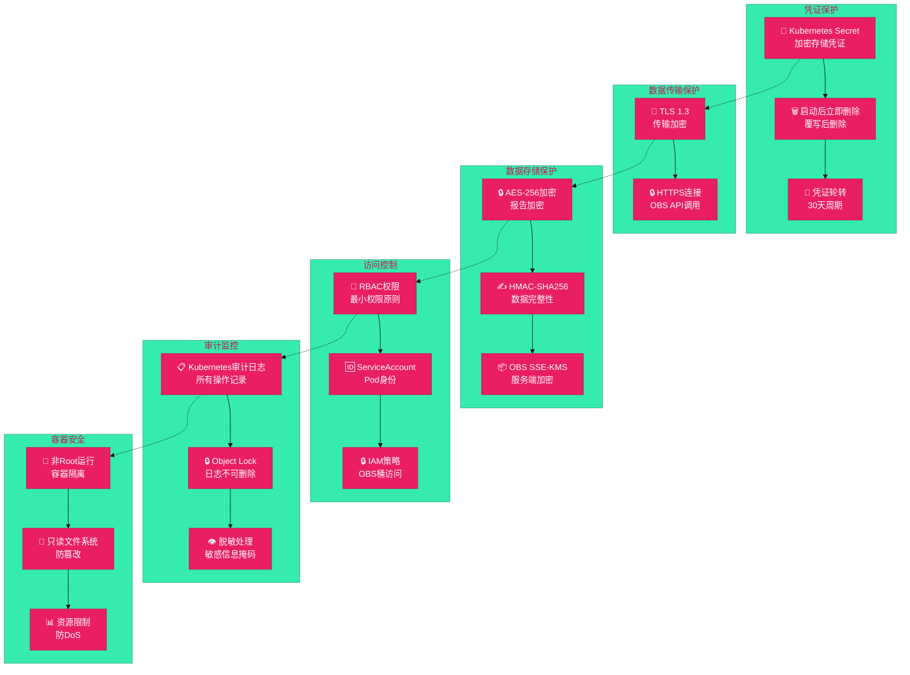

# #67 LTS日志敏感信息扫描 架构设计说明书 (Architecture Design Document)

---

## 1. 基础信息

* **需求链接**: **[#67 支持扫描各个云账号LTS服务运行日志敏感信息](https://github.com/opensourceways/backlog/issues/67)**
* **需求名称**: **支持扫描各个云账号LTS服务运行日志敏感信息**
* **开发责任人**: **zkhzkhz**
* **设计目标**: **通过定期自动化扫描挂载的OBS日志目录，使用gitleaks工具检测敏感信息，生成结构化报告定位问题namespace和pod，同时确保扫描过程和结果本身的安全性（凭证保护、结果加密、访问控制）。凭证通过配置文件注入，启动后立即删除。**

---

## 2. 功能设计

> **说明**：描述系统的组件构成、职责划分及交互逻辑。

### 2.1 架构图

> 此处建议插入架构拓扑系统组件图或时序图,描述组件间的交互关系。

**设计说明/归档：**

**系统架构分层图**：



**架构说明：**

- **定时任务层**：使用APScheduler或Kubernetes CronJob定期触发扫描任务（月度或按需）
- **扫描编排层**：主控制器，协调各个模块的执行流程，处理错误和重试
- **凭证管理层**：从配置文件读取OBS凭证，启动后立即删除配置文件，避免硬编码
- **多云账号OBS层**：各云账号的OBS桶通过NFS/S3挂载到Pod，存储LTS归档的日志文件
- **扫描处理层**：
  - 日志扫描器：直接扫描挂载目录中最近三天的日志文件
  - 敏感信息扫描器：集成gitleaks工具，检测密钥、Token、凭证等
  - 结果解析器：从扫描结果中提取namespace和pod信息
- **报告生成层**：生成JSON格式的结构化报告，使用AES-256加密
- **结果存储层**：将加密报告上传到OBS结果桶，设置严格的访问权限
- **审计日志层**：记录扫描过程（脱敏），便于事后审计和问题追踪

### 2.2 数据流图

> 此处建议插入数据流图，描述核心业务数据的生命周期，即威胁建模。

**设计说明/归档：**

**数据流程图**：


**数据流说明：**

1. **输入阶段**：读取扫描配置（云账号、时间范围）和OBS凭证（从配置文件）
2. **凭证清理**：读取完成后立即删除凭证配置文件（覆写后删除），凭证保存在内存中供后续使用
3. **处理阶段**：
   - 扫描：直接扫描挂载目录中最近三天的日志文件
   - 检测：使用gitleaks检测敏感信息
   - 解析：从扫描结果中提取namespace和pod
   - 富化：添加时间戳、日志来源等元数据
4. **输出阶段**：
   - 生成JSON格式报告
   - 使用AES-256加密
   - 上传到OBS结果桶（设置严格访问权限）
5. **审计阶段**：记录所有操作的脱敏日志，不记录完整的敏感信息

### 2.3 组件职责与接口

> 列出新增/修改的组件及其定义的 API 规范。

**设计说明/归档：**

**组件交互时序图**：



**组件接口定义表**：
| 组件名称 | 功能描述 | 输入 | 输出 | 接口方法 |
|---------|------|------|------|---------|
| **扫描编排服务** | 协调整个扫描流程，管理生命周期 | 扫描配置(JSON) | 扫描状态、错误信息 | `start_scan(config)`, `get_status()`, `cancel_scan()` |
| **凭证管理器** | 从配置文件读取凭证，启动后删除配置文件 | 配置文件路径 | OBS凭证(AK/SK) | `load_credentials()`, `cleanup_credentials()` |
| **日志扫描器** | 扫描挂载目录中的日志文件，过滤最近三天 | 挂载目录路径、时间范围 | 日志文件列表 | `scan_directory(path, time_range)`, `get_log_files()` |
| **敏感信息扫描器** | 调用gitleaks进行敏感信息检测 | 日志文件路径 | 扫描结果(JSON.GZ) | `scan_files(file_paths)`, `get_scan_result()` |
| **结果解析器** | 从扫描结果中提取namespace和pod信息 | 扫描结果(JSON.GZ) | 结构化报告(JSON) | `parse_results(scan_result)`, `extract_metadata()` |
| **报告生成器** | 生成最终的结构化报告 | 解析后的数据 | 报告JSON | `generate_report(parsed_data)` |
| **加密器** | 使用AES-256加密报告 | 报告JSON、加密密钥 | 加密报告(二进制) | `encrypt_report(report, key)`, `decrypt_report(encrypted, key)` |
| **结果上传器** | 将加密报告上传到OBS结果桶 | 加密报告、目标路径 | 上传状态 | `upload_report(encrypted_data, target_path)` |
| **审计日志记录器** | 记录扫描过程的脱敏日志 | 操作事件 | 审计日志 | `log_event(event_type, details)` |

### 2.4 UX设计

> 设计目标：确保功能不仅"可用"，而且"好用"，降低开发者的认知负担和运维人员的误操作风险。

**设计说明/归档：**

不涉及。原因：本需求是后台定时扫描任务，无用户交互界面。运维人员通过查看OBS中的扫描报告了解结果，通过配置文件或环境变量配置扫描参数。

### 2.5 SOD设计

> 设计目标：通过维护SOD权限设计文档，确保权限设计可审计、可复用、可跨服务重用。

**设计说明/归档：**

不涉及。原因：本需求是自动化扫描任务，无复杂的权限分离需求。扫描任务以服务账号运行，具有OBS读权限和结果桶写权限。

### 2.6 功能设计分解TASK清单

**设计说明/归档：**

**工作分解结构（WBS）**：



**任务清单:**

| 任务 ID | 功能任务描述 | 责任人 |
|--------|-----------|------|
| **TASK1** | 实现扫描编排服务框架，支持定时触发和手动触发，包含错误处理和重试机制 | zkhzkhz |
| **TASK2** | 实现凭证管理模块，从配置文件读取OBS凭证，启动后立即删除配置文件（覆写后删除） | zkhzkhz |
| **TASK3** | 实现日志扫描器，扫描挂载目录中最近三天的日志文件，支持多云账号 | zkhzkhz |
| **TASK4** | 集成gitleaks工具，实现敏感信息扫描和结果解析 | zkhzkhz |
| **TASK5** | 实现结果解析器，从扫描结果中提取namespace和pod信息，生成结构化报告 | zkhzkhz |
| **TASK6** | 实现报告加密和上传功能，使用AES-256加密，上传到OBS结果桶 | zkhzkhz |

### 2.7 部署架构

**设计说明/归档：**

**Kubernetes 部署架构图**：



**部署说明：**

- **CronJob**：Kubernetes原生定时任务，按月度或按需触发扫描
- **Pod**：扫描容器，以非Root用户运行，资源限制已设置
- **Secret**：存储凭证配置文件路径和加密密钥，由Kubernetes加密存储
- **ConfigMap**：存储扫描配置（云账号列表、时间范围等）
- **OBS挂载**：通过NFS或S3挂载各云账号的OBS日志目录到Pod（`/mnt/obs/`）
- **凭证配置文件**：启动时从Secret读取，启动后立即删除（覆写后删除）
- **日志收集**：脱敏处理后发送到日志系统，保留90天
- **监控告警**：实时监控扫描状态，异常时告警

---

## 3. 非功能设计

### 3.1 安全与隐私设计评估和设计

> **注意**：仅当需求判定为 **`need_security`** 时，本章节为必填项。

> 关注点：防御能力与合规边界。

### 3.1.1 威胁建模与数据流分析 (Threat Modeling)

> 基于 **STRIDE** 方法，通过DFD数据流图识别系统中的关键数据流和风险点。

**设计说明/归档：**

**DFD数据流图 - 信任边界与关键数据流**：



**数据流说明：**

**信任边界1 (Kubernetes集群 - 受信任执行环境)：**
- 所有扫描逻辑和数据处理都在容器内执行
- 完整的处理流水线：读凭证 → 编排 → 扫描 → 加密 → 上传

**信任边界2 (外部OBS存储 - 不完全受信任)：**
- OBS日志桶：输入数据源（NFS/S3挂载的日志文件）
- OBS结果桶：加密报告输出存储

**关键数据流（跨越信任边界的高风险点）：**

| 序号 | 数据流 | 来源 → 目标 | 内容 | 风险 | 缓解措施 |
|------|--------|-----------|------|------|---------|
| 1️⃣ | 日志读取 | OBSLogs → LogScanner | 原始日志文件 | 网络嗅探、篡改 | TLS 1.3、IAM权限 |
| 2️⃣ | 报告上传 | Uploader → OBSResults | AES-256加密+签名 | 中间人攻击、泄露 | HMAC验证、Object Lock |
| 3️⃣ | 凭证读取 | Secret → CredMgr | OBS访问凭证 | 凭证泄露 | 启动后立即删除 |
| 4️⃣ | 审计记录 | Orchestrator → AuditLogs | 脱敏操作日志 | 日志篡改 | Object Lock保护 |

---

**威胁分析详情** (STRIDE方法，16个威胁)：

基于4个关键数据流跨越信任边界的风险识别。

| 威胁ID | 威胁名称 | STRIDE类别 | 风险等级 | 关联数据流 | 风险场景 | 缓解措施 |
|--------|---------|-----------|---------|----------|---------|---------|
| S-001 | 伪造扫描任务身份 | Spoofing | 🔴 高 | CronJob触发 | 定时任务被篡改，执行恶意扫描 | Kubernetes RBAC + 不可变CronJob |
| S-002 | 伪造OBS凭证 | Spoofing | 🔴 高 | 凭证读取(Secret) | Secret中的凭证被复制冒用 | Secret加密 + 凭证启动后删除 |
| T-001 | 篡改扫描结果 | Tampering | 🔴 高 | 报告上传(Uploader→OBSResults) | 加密报告在OBS中被篡改 | HMAC签名 + Object Lock |
| T-002 | 篡改配置文件 | Tampering | 🟠 中 | 配置读取(ConfigMap) | ConfigMap被修改导致扫描范围变更 | RBAC + 不可变ConfigMap |
| T-003 | 篡改审计日志 | Tampering | 🔴 高 | 审计记录(Orchestrator→AuditLogs) | 审计日志被删除或修改掩盖痕迹 | Object Lock + 不可删除属性 |
| R-001 | 否认扫描操作 | Repudiation | 🟠 中 | 审计记录 | 无法证明扫描任务是否执行过 | Kubernetes审计日志 + 脱敏记录 |
| I-001 | 凭证泄露 | Information | 🔴 高 | 凭证读取(Secret→CredMgr) | OBS凭证在传输或内存中泄露 | 启动后立即删除 + 内存加密 |
| I-002 | 扫描结果泄露 | Information | 🔴 高 | 报告上传(Uploader→OBSResults) | 加密报告在网络传输中被窃取 | AES-256加密 + TLS 1.3 |
| I-003 | 日志内容泄露 | Information | 🔴 高 | 日志读取(OBSLogs→LogScanner) | 原始日志文件在传输中被窃听 | IAM策略 + 日志桶加密 |
| I-004 | 审计日志泄露 | Information | 🟠 中 | 审计记录(Orchestrator→AuditLogs) | 审计日志被未授权访问 | 访问控制 + 日志加密 |
| D-001 | 资源耗尽 | Denial | 🟠 中 | Orchestrator协调 | 恶意配置导致扫描过度消耗资源 | 并发限制 + 超时机制 |
| D-002 | 日志存储耗尽 | Denial | 🟠 中 | 日志读取(OBSLogs) | OBS日志桶被填满导致无法读取 | 容量限制 + 监控告警 |
| D-003 | 扫描任务阻塞 | Denial | 🟠 中 | LogScanner执行 | 恶意日志文件导致扫描阻塞 | 超时机制 + 自动重试 |
| E-001 | 容器逃逸 | Elevation | 🔴 高 | 容器执行过程 | 容器漏洞被利用逃逸获取宿主机权限 | Pod安全策略 + 只读文件系统 |
| E-002 | RBAC权限提升 | Elevation | 🔴 高 | Orchestrator协调 | 通过RBAC权限链实现权限提升 | 最小权限原则 + 定期审计 |
| E-003 | Secret访问提升 | Elevation | 🔴 高 | 凭证读取(Secret) | 通过ServiceAccount权限链访问Secret | RBAC细粒度 + 外部密钥管理 |

**威胁汇总**：
- **总威胁数**: 16个（STRIDE全覆盖）
- **高风险(P1)**: 10个
- **中风险(P2)**: 6个

### 3.1.2 安全设计实现 (Security Mechanisms)

> **参考**：威胁模型评估与安全设计实现

**设计说明/归档：**

**安全防御机制全景**：



**凭证管理：**
- ✅ 严禁硬编码：所有OBS凭证(AK/SK)存储在Kubernetes Secret或云密钥管理服务
- ✅ 密钥轮转：支持定期自动轮转凭证，通过环境变量或配置文件更新
- ✅ 最小权限：OBS凭证仅授予特定桶的读权限和结果桶的写权限

**凭证注入与清理机制：**

凭证通过以下流程安全注入和清理：

1. **启动前注入**：
   - Kubernetes Secret挂载到Pod的临时目录（`/tmp/credentials/`）
   - 或从Vault/密钥管理服务读取凭证写入临时配置文件
   - 配置文件权限设置为 `600`（仅所有者可读）

2. **启动时加载**：
   ```go
   package main

   import (
       "encoding/json"
       "fmt"
       "os"
       "path/filepath"
   )

   type Credentials struct {
       AccessKey string `json:"access_key"`
       SecretKey string `json:"secret_key"`
       Endpoint  string `json:"endpoint"`
   }

   func loadCredentials() (*Credentials, error) {
       credFile := filepath.Join("/tmp/credentials", "obs-credentials.json")

       data, err := os.ReadFile(credFile)
       if err != nil {
           return nil, fmt.Errorf("credentials file not found: %w", err)
       }

       var creds Credentials
       if err := json.Unmarshal(data, &creds); err != nil {
           return nil, fmt.Errorf("invalid credentials format: %w", err)
       }

       if creds.AccessKey == "" || creds.SecretKey == "" || creds.Endpoint == "" {
           return nil, fmt.Errorf("missing required credential fields")
       }

       return &creds, nil
   }

   func main() {
       creds, err := loadCredentials()
       if err != nil {
           panic(err)
       }
       _ = creds // 使用凭证
   }
   ```

3. **启动后清理**：
   ```go
   package main

   import (
       "crypto/rand"
       "fmt"
       "os"
       "path/filepath"
   )

   func cleanupCredentials() error {
       credFile := filepath.Join("/tmp/credentials", "obs-credentials.json")

       fileInfo, err := os.Stat(credFile)
       if err != nil {
           if os.IsNotExist(err) {
               return nil // 文件不存在，无需清理
           }
           return err
       }

       // 方式1：覆写后删除（更安全）
       file, err := os.OpenFile(credFile, os.O_WRONLY, 0600)
       if err != nil {
           return fmt.Errorf("failed to open credentials file: %w", err)
       }
       defer file.Close()

       // 用随机数据覆写
       randomData := make([]byte, fileInfo.Size())
       if _, err := rand.Read(randomData); err != nil {
           return fmt.Errorf("failed to generate random data: %w", err)
       }

       if _, err := file.Write(randomData); err != nil {
           return fmt.Errorf("failed to overwrite credentials: %w", err)
       }

       // 删除文件
       if err := os.Remove(credFile); err != nil {
           return fmt.Errorf("failed to remove credentials file: %w", err)
       }

       fmt.Printf("Credentials file cleaned: %s\n", credFile)
       return nil
   }

   func main() {
       creds, err := loadCredentials()
       if err != nil {
           defer cleanupCredentials()
           panic(err)
       }

       defer func() {
           if err := cleanupCredentials(); err != nil {
               fmt.Printf("Warning: Failed to clean credentials: %v\n", err)
           }
       }()

       _ = creds // 继续应用逻辑
   }
   ```

4. **内存中的凭证管理**：
   - 凭证加载到内存后，不再从磁盘读取
   - 使用时通过变量引用，避免重复读取文件
   - 应用关闭时，内存中的凭证自动释放

5. **Kubernetes Pod配置示例**：
   ```yaml
   apiVersion: v1
   kind: Pod
   metadata:
     name: log-scanner
   spec:
     serviceAccountName: log-scanner
     containers:
     - name: scanner
       image: log-scanner:latest
       env:
       - name: CRED_FILE_PATH
         value: /tmp/credentials/obs-credentials.json
       volumeMounts:
       - name: credentials
         mountPath: /tmp/credentials
         readOnly: true
       securityContext:
         runAsNonRoot: true
         runAsUser: 1000
         readOnlyRootFilesystem: true
       resources:
         limits:
           memory: "256Mi"
           cpu: "500m"
     volumes:
     - name: credentials
       secret:
         secretName: obs-credentials
         defaultMode: 0600  # 仅所有者可读
   ```

**数据安全：**
- ✅ 传输加密：所有与OBS的通信使用TLS 1.2+
- ✅ 静态加密：扫描报告使用AES-256加密存储在OBS
- ✅ 完整性保护：报告使用HMAC签名，防止篡改

**运行时隔离：**
- ✅ 非Root运行：扫描容器以非Root用户运行
- ✅ 只读文件系统：容器根文件系统设置为只读，仅允许写入临时目录
- ✅ 资源限制：设置CPU和内存限制，防止资源耗尽

**日志审计：**
- ✅ 脱敏日志：审计日志不记录完整的敏感信息，仅记录操作类型、时间戳、云账号ID
- ✅ 日志保留：审计日志保留至少90天，便于事后审计
- ✅ 日志加密：审计日志也使用加密存储

**访问控制：**
- ✅ OBS结果桶权限：仅授予特定的IAM角色读权限
- ✅ 报告加密密钥：密钥存储在密钥管理服务，不在代码中硬编码
- ✅ 审计日志访问：仅授予安全团队和运维团队查看权限

### 3.1.3 安全任务分解

**任务清单:**

| 任务 ID | 安全任务描述 | 责任人 |
|--------|-----------|------|
| **SEC-TASK1** | 设计和实现凭证管理模块，集成Kubernetes Secret或云密钥管理服务，支持凭证轮转 | zkhzkhz |
| **SEC-TASK2** | 实现报告加密和HMAC签名机制，使用AES-256和SHA-256 | zkhzkhz |
| **SEC-TASK3** | 配置OBS结果桶的访问权限和版本控制，确保只有授权用户可访问 | zkhzkhz |
| **SEC-TASK4** | 实现审计日志脱敏机制，确保日志中不记录完整的敏感信息 | zkhzkhz |
| **SEC-TASK5** | 配置容器安全策略，包括非Root运行、只读文件系统、资源限制 | zkhzkhz |
| **SEC-TASK6** | 进行安全测试和渗透测试，验证凭证管理、加密、访问控制的有效性 | zkhzkhz |

### 3.2 可靠性设计评估和设计（可选）

> **关注点**：系统的容错能力与故障恢复。

**设计说明/归档：**

不涉及。原因：本需求是定期批处理任务，非关键路径服务。扫描失败可在下一个周期重试，无需高可用设计。

### 3.3 可服务性设计评估和设计（可选）

> **关注点**：系统的可观测性、可维护性与故障排查能力。

**设计说明/归档：**

不涉及。原因：本需求是批处理任务，无长驻服务。通过审计日志和扫描报告进行故障排查即可。

### 3.4 性能与伸缩性评估和设计（可选）

> **关注点**：社区生态兼容性与未来扩展。

**设计说明/归档：**

不涉及。原因：本需求是定期扫描任务，无高并发要求。日志下载和扫描可通过并发控制实现，无需特殊的性能优化。

---
