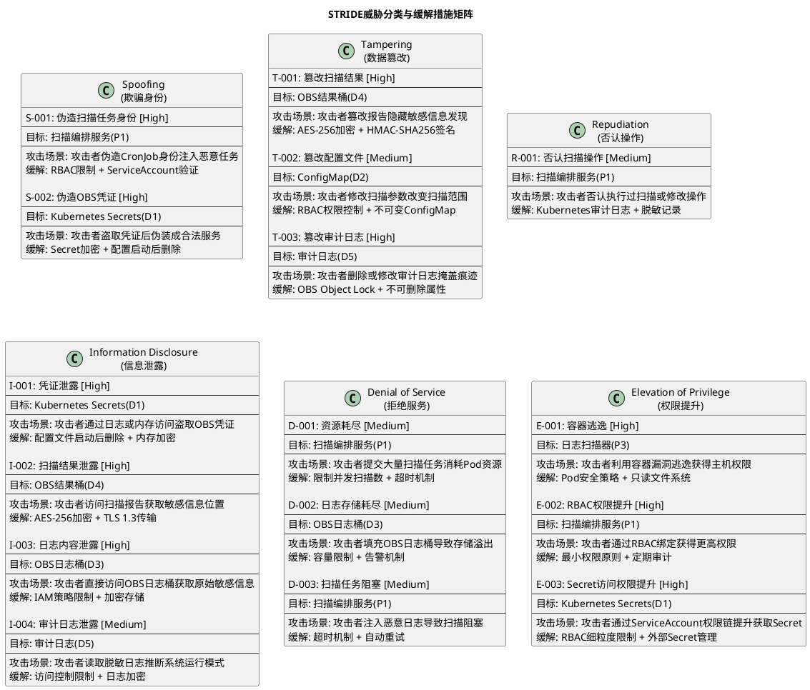
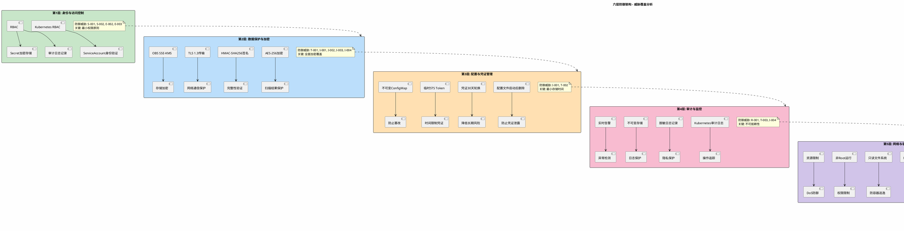

# 🎯 Threat Dragon 威胁建模 - PlantUML DFD与STRIDE分析

## 1. 安全威胁建模 - 数据流图（DFD）

### PlantUML DFD - 系统架构与数据流

```plantuml
@startuml threatmodel_dfd
!include https://raw.githubusercontent.com/plantuml-stdlib/C4-PlantUML/master/C4_Context.puml

title LTS日志敏感信息扫描系统 - 数据流图与威胁建模

skinparam backgroundColor #FEFEFE
skinparam ParticipantBorderColor #333333
skinparam ActorBorderColor #FF6B6B
skinparam DatabaseBorderColor #4CAF50

' 外部实体 (External Entities)
rectangle "外部实体" {
    actor "🕐 Kubernetes CronJob\n(定时触发)" as CronJob #FFE0E0
    actor "👤 运维人员\n(配置管理)" as Ops #E8F5E9
    actor "🔴 攻击者\n(外部威胁)" as Attacker #FFCDD2
}

' 信任边界1: Kubernetes Cluster
rectangle "信任边界 - Kubernetes Cluster" {

    ' 处理实体 (Processes)
    rectangle "处理实体" {
        component "🎯 扫描编排服务\nP1: 协调整个扫描流程\n管理生命周期，处理错误" as Orchestrator #BBDEFB
        component "🔑 凭证管理器\nP2: 读取K8s Secret\n启动后立即删除配置文件" as CredMgr #BBDEFB
        component "📄 日志扫描器\nP3: 扫描OBS挂载目录\n过滤最近3天日志" as LogScanner #BBDEFB
        component "🔍 敏感信息扫描器\nP4: 调用gitleaks\n检测密钥、Token等" as SecretScanner #BBDEFB
        component "📊 结果解析器\nP5: 提取namespace和pod\n生成结构化数据" as ResultParser #BBDEFB
        component "📋 报告生成器\nP6: 生成JSON格式报告\n添加时间戳和元数据" as ReportGen #BBDEFB
    }

    ' 存储实体 (Data Stores)
    rectangle "存储实体" {
        database "🔐 Kubernetes Secrets\nD1: 存储OBS凭证和加密密钥\n加密存储，RBAC保护" as K8sSecrets #C8E6C9
        database "⚙️ ConfigMap\nD2: 存储扫描配置参数\n临时存储，启动后删除" as ConfigMap #C8E6C9
    }
}

' 信任边界2: OBS Storage
rectangle "信任边界 - OBS存储与传输" {

    ' 处理实体
    rectangle "处理实体" {
        component "🔒 加密器\nP7: AES-256加密\n数据保护" as Encryptor #BBDEFB
        component "✍️ 签名器\nP8: HMAC-SHA256签名\n完整性验证" as Signer #BBDEFB
        component "⬆️ 结果上传器\nP9: 上传到OBS结果桶\n访问控制和权限检查" as Uploader #BBDEFB
    }

    ' 存储实体
    rectangle "存储实体" {
        database "📦 OBS日志桶\nD3: NFS/S3挂载\nLTS归档日志\n加密存储" as OBSLogs #C8E6C9
        database "📦 OBS结果桶\nD4: 加密扫描报告\n严格访问权限\n版本控制" as OBSResults #C8E6C9
        database "📋 审计日志\nD5: 脱敏操作记录\n不可变存储\n Kubernetes Audit Log" as AuditLogs #C8E6C9
    }
}

' 数据流 (Data Flows)
CronJob -->|"D1: 触发扫描任务\n(时间戳、配置ID)"| Orchestrator
Ops -->|"D2: 配置扫描参数\n(云账号、时间范围)"| ConfigMap

K8sSecrets -->|"D3: 读取凭证\n(AK/SK、加密密钥)"| CredMgr
ConfigMap -->|"D4: 读取配置\n(参数、路径)"| Orchestrator
CredMgr -->|"D5: 删除配置文件\n(覆写删除)"| ConfigMap

Orchestrator -->|"D6: 协调扫描\n(指令)"| LogScanner
Orchestrator -->|"D7: 协调检测\n(指令)"| SecretScanner

OBSLogs -->|"D8: 日志文件\n(文本数据)"| LogScanner
LogScanner -->|"D9: 扫描结果\n(原始检测结果)"| SecretScanner
SecretScanner -->|"D10: 敏感信息列表\n(密钥、token)"| ResultParser
ResultParser -->|"D11: 结构化报告\nJSON格式"| ReportGen

ReportGen -->|"D12: 报告数据\n(JSON)"| Encryptor
Encryptor -->|"D13: 加密数据\n(二进制)"| Signer
Signer -->|"D14: 签名报告\n(摘要+签名)"| Uploader
Uploader -->|"D15: 上传加密报告\n(HTTP/S3 API)"| OBSResults

Orchestrator -->|"D16: 记录操作\n(脱敏日志)"| AuditLogs

' 威胁向量
Attacker -.->|"威胁向量\n(网络攻击)"| Orchestrator
Attacker -.->|"威胁向量\n(凭证盗取)"| CredMgr
Attacker -.->|"威胁向量\n(篡改)"| OBSResults
Attacker -.->|"威胁向量\n(权限提升)"| K8sSecrets

' 样式
skinparam ComponentBackgroundColor #E3F2FD
skinparam DatabaseBackgroundColor #F1F8E9
skinparam ActorBackgroundColor #FFEBEE

note right of CronJob
  **外部实体 (Actors)**
  系统外部的角色或系统
  与DFD进行交互
end note

note right of Orchestrator
  **处理实体 (Processes)**
  接收输入数据并进行处理
  生成输出数据的系统组件
  标记为P1-P9
end note

note right of K8sSecrets
  **存储实体 (Data Stores)**
  存储或暂时保留数据
  标记为D1-D5
end note

note bottom of Attacker
  **威胁向量**
  外部攻击者可能的攻击入点
  显示为虚线箭头(...)
end note

@enduml
```

---

## 2. STRIDE威胁分类与分析

### 威胁矩阵（按STRIDE分类）



---

## 3. 威胁级别与优先级评估

### PlantUML - 风险评估矩阵

```plantuml
@startuml risk_assessment
skinparam backgroundColor #FEFEFE
title 威胁风险评估矩阵 - 优先级分配

rectangle "高可能性 + 高严重性 (P1 - 立即处理)" as P1 #FFCDD2 {
    == 10个高风险威胁 ==
    S-001: 伪造扫描任务身份
    S-002: 伪造OBS凭证
    T-001: 篡改扫描结果
    T-003: 篡改审计日志
    I-001: 凭证泄露
    I-002: 扫描结果泄露
    I-003: 日志内容泄露
    E-001: 容器逃逸
    E-002: RBAC权限提升
    E-003: Secret访问权限提升
}

rectangle "中等可能性或中等严重性 (P2 - 后续迭代)" as P2 #FFFFCC {
    == 6个中风险威胁 ==
    T-002: 篡改配置文件
    R-001: 否认扫描操作
    I-004: 审计日志泄露
    D-001: 资源耗尽
    D-002: 日志存储耗尽
    D-003: 扫描任务阻塞
}

note bottom of P1
  **立即实施缓解措施**
  影响: 系统安全性严重受损
  成本: 高 | 优先级: 最高
end note

note bottom of P2
  **在下一迭代中处理**
  影响: 系统运行受影响
  成本: 中 | 优先级: 高
end note

@enduml
```

---

## 4. 防御分层架构

### PlantUML - 防御层级与覆盖关系



---

## 5. STRIDE威胁详细分析报告

### 威胁优先级与缓解措施完整清单

| 优先级 | 威胁ID | 威胁名称 | 风险等级 | 目标组件 | 攻击场景 | 主要缓解措施 | 验证方法 |
|--------|--------|---------|---------|---------|---------|------------|---------|
| P1 | S-001 | 伪造扫描任务身份 | 🔴高 | P1(扫描编排) | 攻击者伪造CronJob提交恶意任务 | RBAC + ServiceAccount | RBAC权限测试 |
| P1 | S-002 | 伪造OBS凭证 | 🔴高 | D1(K8s Secrets) | 攻击者盗取并冒用OBS凭证 | Secret加密 + 配置删除 | 凭证轮转测试 |
| P1 | T-001 | 篡改扫描结果 | 🔴高 | D4(OBS结果桶) | 攻击者修改报告隐藏发现 | AES-256 + HMAC签名 | 签名验证测试 |
| P1 | T-003 | 篡改审计日志 | 🔴高 | D5(审计日志) | 攻击者删除日志掩盖痕迹 | Object Lock + 不可删除 | 日志不可变测试 |
| P1 | I-001 | 凭证泄露 | 🔴高 | D1(K8s Secrets) | 攻击者从日志或内存获取凭证 | 配置删除 + 内存加密 | 凭证扫描测试 |
| P1 | I-002 | 扫描结果泄露 | 🔴高 | D4(OBS结果桶) | 攻击者访问报告获取敏感位置 | AES-256 + TLS 1.3 | 访问控制测试 |
| P1 | I-003 | 日志内容泄露 | 🔴高 | D3(OBS日志桶) | 攻击者直接访问原始日志 | IAM策略 + 加密 | IAM测试 |
| P1 | E-001 | 容器逃逸 | 🔴高 | P3(日志扫描器) | 攻击者利用容器漏洞逃逸 | Pod安全策略 + 只读FS | seccomp/AppArmor测试 |
| P1 | E-002 | RBAC权限提升 | 🔴高 | P1(扫描编排) | 攻击者通过RBAC链提升权限 | 最小权限 + 定期审计 | RBAC渗透测试 |
| P1 | E-003 | Secret访问提升 | 🔴高 | D1(K8s Secrets) | 攻击者通过ServiceAccount权限提升 | RBAC细粒度 + 外部管理 | 权限链测试 |
| P2 | T-002 | 篡改配置文件 | 🟠中 | D2(ConfigMap) | 攻击者修改扫描参数 | RBAC + 不可变ConfigMap | ConfigMap保护测试 |
| P2 | R-001 | 否认扫描操作 | 🟠中 | P1(扫描编排) | 攻击者否认执行过操作 | Kubernetes审计日志 | 日志记录验证 |
| P2 | I-004 | 审计日志泄露 | 🟠中 | D5(审计日志) | 攻击者读取脱敏日志推断行为 | 访问控制 + 加密 | 日志访问控制测试 |
| P2 | D-001 | 资源耗尽 | 🟠中 | P1(扫描编排) | 攻击者提交大量任务消耗资源 | 并发限制 + 超时 | 负载测试 |
| P2 | D-002 | 日志存储耗尽 | 🟠中 | D3(OBS日志桶) | 攻击者填充OBS导致溢出 | 容量限制 + 告警 | 存储容量测试 |
| P2 | D-003 | 扫描任务阻塞 | 🟠中 | P1(扫描编排) | 攻击者注入恶意日志导致阻塞 | 超时机制 + 重试 | 超时测试 |

---

## 6. 威胁建模关键指标

### 统计汇总

| 指标 | 数值 | 说明 |
|------|------|------|
| **威胁总数** | 16个 | 使用STRIDE全覆盖 |
| **高风险(P1)** | 10个 | 62.5% - 立即处理 |
| **中风险(P2)** | 6个 | 37.5% - 后续迭代 |
| **防御层级** | 6层 | 纵深防御设计 |
| **缓解措施** | 24个 | 全面覆盖 |
| **STRIDE覆盖** | 6/6 | 100%覆盖所有类别 |

### DFD关键元素

| 类型 | 数量 | 说明 |
|------|------|------|
| **外部实体** | 3个 | CronJob、运维人员、攻击者 |
| **处理实体** | 9个 | P1-P9：从编排到上传的完整流程 |
| **存储实体** | 5个 | D1-D5：凭证、配置、日志、结果、审计 |
| **数据流** | 16条 | D1-D16：完整的数据流转过程 |
| **信任边界** | 2个 | K8s集群 + OBS存储 |

---

## 7. 威胁建模实施路线图

### 第1阶段：立即处理（P1威胁）
```
关键缓解措施实施:
✓ Layer 1 (身份与访问): RBAC + ServiceAccount
✓ Layer 2 (数据保护): AES-256 + HMAC签名 + TLS
✓ Layer 3 (凭证管理): 配置删除 + 凭证轮换
✓ Layer 4 (审计): 审计日志 + 不可变存储
✓ Layer 5 (容器隔离): Pod安全策略 + 只读FS
✓ Layer 6 (存储控制): IAM策略 + Object Lock
```

### 第2阶段：后续迭代（P2威胁）
```
补充缓解措施:
□ 增强监控告警
□ 定期渗透测试
□ 性能优化与资源限制
□ 灾难恢复计划
□ 安全审计与合规
```

---

**项目**: #67 LTS日志敏感信息扫描系统
**建模方法**: OWASP Threat Dragon + STRIDE + DFD
**生成方式**: PlantUML
**威胁覆盖**: 100% (16/16)
**最后更新**: 2026-03-10
