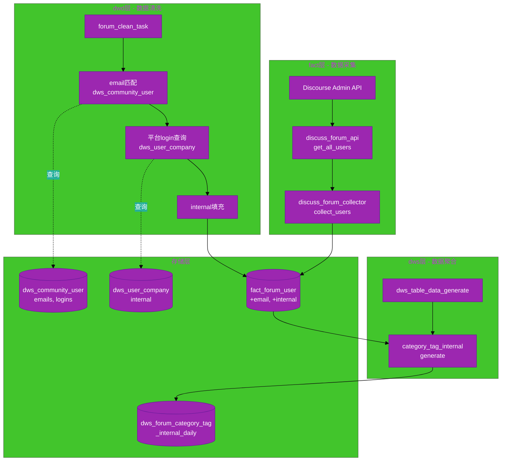
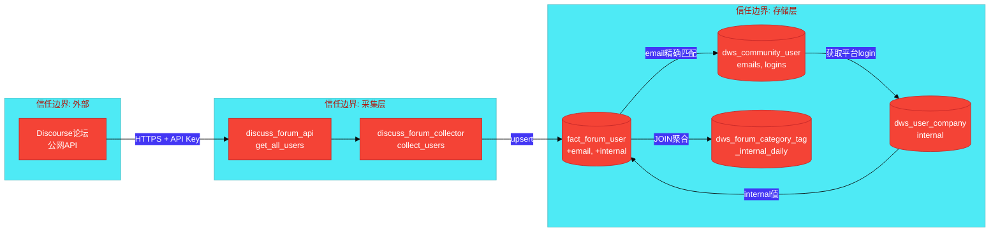
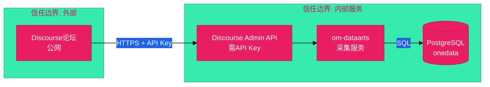

# #314 论坛用户内外部区分 架构设计说明书

## 1. 基础信息

* **需求链接**: https://github.com/opensourceways/backlog/issues/314
* **需求名称**: 论坛用户内外部区分——采集用户邮箱并标识华为/非华为归属
* **开发责任人**: ssignik
* **设计目标**: 通过 Discourse Admin API 采集论坛用户邮箱，复用 ONEID 用户体系和 user_company 数据自动标识用户内外部归属，并扩展 DWS 分析层支持内外部维度统计。

---

## 2. 功能设计

### 2.1 架构图



### 2.2 数据流图



### 2.3 组件职责与接口

#### 2.3.1 discuss_forum_api — 新增 get_all_users()

**职责**: 调用 Discourse Admin API 分页获取所有用户信息

**接口定义**:
```python
def get_all_users(self, base_url: str, api_key: str, api_username: str) -> Generator[list[dict], None, None]:
    """
    分页获取论坛用户信息（含邮箱），按页 yield 返回，避免一次性加载全部数据导致内存过高

    Args:
        base_url: 论坛基础URL
        api_key: 管理员API Key
        api_username: API用户名

    Yields:
        每页用户信息列表，每条包含:
        - id: 论坛用户ID
        - username: 用户名
        - email: 邮箱地址
        - trust_level: 信任等级
        - admin: 是否管理员
        - moderator: 是否版主
        - created_at: 注册时间
        - last_seen_at: 最后活跃时间
        - post_count: 发帖数
        - time_read: 阅读时长
        - days_visited: 访问天数
        - active: 是否活跃

    分页逻辑:
        通过 page 参数遍历（page=0,1,2...），每页约50条
        当返回空列表时停止迭代
    """
```

**API 调用细节**:
- 端点: `{base_url}/admin/users/list/all.json?show_emails=true`
- 请求头: `Api-Key: {api_key}`, `Api-Username: {api_username}`
- 分页: 通过 `page` 参数遍历，每页约 50 条，直到返回空列表
- 限流: Discourse API 默认限流 60 次/分钟，需适当 sleep
- 使用生成器模式按页 yield，collect_users 逐页处理并写入数据库，避免全量数据驻留内存

#### 2.3.2 discuss_forum_collector — 新增 collect_users()

**职责**: 编排用户数据采集流程，写入数据库

**接口定义**:
```python
def collect_users(self, community: str, base_url: str, api_key: str, api_username: str) -> None:
    """
    采集论坛用户数据并写入数据库

    流程:
    1. 调用 API 获取所有用户
    2. 数据映射和清洗
    3. upsert 写入 fact_{community}_forum_user 表
    """
```

**配置依赖**: 需要 `service_platform_config` 中 `params.collect_users = true` 才会执行

#### 2.3.3 forum_clean_task — 新增（dwd 层）

**职责**: 基于 email 匹配 ONEID 体系，填充 internal 字段

**接口定义**:
```python
class ForumCleanTask:
    def run_clean_task(self, community_list: list[str]) -> None:
        """
        对指定社区执行论坛用户 internal 字段清洗

        流程:
        1. 查询 fact_{community}_forum_user 中 email 非空且 internal 为空的用户
        2. 用 email 精确匹配 dws_community_user.emails
        3. 获取匹配用户的 gitee_logins / gitcode_logins / github_logins
        4. 遍历各平台 login 查询 dws_{community}_user_company 获取 internal
        5. 任一平台 internal = "内部" 则结果为 "内部"，否则为 "外部"
        6. 更新 fact_{community}_forum_user.internal 字段
        """
```

**匹配规则详解**:

| 步骤 | 输入 | 操作 | 输出 |
|---|---|---|---|
| 1 | forum_user.email | 精确匹配 dws_community_user.emails 数组 | uuid 或 null |
| 2 | uuid | 读取 gitee_logins, gitcode_logins, github_logins | 平台 login 列表 |
| 3 | (code_platform, user_login) | 查询 dws_user_company | internal 值 |
| 4 | 多个 internal 值 | 任一为"内部"→"内部"，否则→"外部" | 最终 internal |

**SQL 匹配逻辑**（核心）:
```sql
-- 步骤1: email 匹配获取 uuid
SELECT uuid FROM dws_community_user
WHERE emails @> ARRAY[fu.email]::text[]

-- 步骤2+3+4: 获取 internal
SELECT COALESCE(
    (SELECT '内部' WHERE EXISTS (
        SELECT 1 FROM dws_{community}_user_company uc
        WHERE uc.uuid = du.uuid
        AND uc.internal = '内部'
    )),
    '外部'
) AS internal
FROM dws_community_user du
WHERE du.emails @> ARRAY[fu.email]::text[]
```

#### 2.3.4 community_forum_category_tag_internal_generate — 新增

**职责**: 生成按日期+分类+标签+内外部维度的统计表

**接口定义**:
```python
def generate_forum_category_tag_internal_daily(community: str, db_client: PostgresClient) -> None:
    """
    生成论坛分类+标签+内外部按天统计表

    聚合逻辑:
    1. JOIN fact_forum_user 获取 topic 作者的 internal 值
    2. 在现有 category_tag_daily 基础上增加 internal 维度
    3. GROUP BY date, category_id, category_name, tag, internal
    4. 原子表交换写入
    """
```

### 2.4 UX设计

不涉及。本需求为后端数据采集和分析功能，无用户界面变更。

### 2.5 SOD设计

不涉及。本需求不改变权限模型。

### 2.6 功能设计分解TASK清单

| 任务 ID | 可服务性任务描述 | 责任人 |
|---|---|---|
| **TASK1** | discuss_forum_api 新增 get_all_users() 方法，支持分页、限流处理 | ssignik |
| **TASK2** | discuss_forum_collector 新增 collect_users()，含数据映射和 upsert 逻辑 | ssignik |
| **TASK3** | forum_table.py 新增 email、internal 字段定义 | ssignik |
| **TASK4** | forum_clean_task 实现 internal 填充逻辑（email→ONEID→user_company） | ssignik |
| **TASK5** | service_platform_config 增加 collect_users 配置项 | ssignik |
| **TASK6** | dws_table.py 新增 forum_category_tag_internal_daily 表定义 | ssignik |
| **TASK7** | community_forum_category_tag_internal_generate.py 实现聚合逻辑 | ssignik |
| **TASK8** | forum_task 集成用户采集，dws_table_data_generate 集成新 DWS | ssignik |

---

## 3. 非功能设计

### 3.1 安全与隐私设计评估和设计

#### 3.1.1 威胁分析 (Threat Modeling)



| 威胁类别 | 攻击场景描述 | 风险等级 | 对应减缓措施 |
|---|---|---|---|
| **信息泄露** | API Key 泄露导致可获取全量用户邮箱 | 中 | API Key 通过 AES 加密存储在 service_platform_config，解密仅在内存中 |
| **隐私泄露** | 用户邮箱数据在日志中明文输出 | 中 | 日志中不输出邮箱信息，仅记录采集数量 |
| **篡改** | 中间人攻击截获 API 通信 | 低 | 强制 HTTPS 通信 |

#### 3.1.2 安全设计实现

* **凭证管理**: API Key 复用现有 `service_platform_config.token` 字段的 AES 加密机制，不新增独立的凭证存储
* **数据安全**: email 字段存储在内部数据库（PostgreSQL），不对外暴露；DWS 统计表仅聚合维度，不含明细邮箱
* **日志脱敏**: 采集日志中仅记录用户数量和采集状态，禁止输出用户邮箱明文
* **传输加密**: API 调用强制 HTTPS

#### 3.1.3 安全任务分解

| 任务 ID | 安全任务描述 | 责任人 |
|---|---|---|
| **SEC1** | 确认 API Key 加密存储和传输安全 | ssignik |
| **SEC2** | 确保日志中不输出用户邮箱明文 | ssignik |

### 3.2 可靠性与韧性设计

* **增量采集**: 支持 full/incremental 模式，避免重复采集
* **降级策略**: 当 API 不可用时（如限流、网络故障），记录进度并跳过，不影响其他采集任务
* **幂等设计**: 使用 upsert 逻辑，重复执行不会产生重复数据
* **分页容错**: API 分页获取时，单页失败不影响已获取的数据

### 3.3 可服务性与可观测性

* **采集日志**: 记录采集的用户数量、分页进度、耗时
* **匹配报告**: 清洗任务输出 email 匹配率、internal 分布统计
* **配置开关**: 通过 `service_platform_config.params.collect_users` 控制是否启用

---

## 附录：表结构设计

### A. fact_{community}_forum_user 变更

```sql
-- 新增字段
ALTER TABLE fact_{community}_forum_user
ADD COLUMN IF NOT EXISTS email VARCHAR(512) NULL,
ADD COLUMN IF NOT EXISTS internal VARCHAR(10) NULL;

-- 索引（用于 internal 填充查询加速）
CREATE INDEX IF NOT EXISTS idx_{table_name}_email
ON fact_{community}_forum_user(email)
WHERE email IS NOT NULL;
```

### B. dws_{community}_forum_category_tag_internal_daily 新增表

```sql
CREATE TABLE IF NOT EXISTS dws_{community}_forum_category_tag_internal_daily (
    uuid VARCHAR(500) NOT NULL,
    sub_community VARCHAR(255),
    date DATE,
    category_id VARCHAR(512),
    category_name VARCHAR(512),
    tag VARCHAR(512),
    internal VARCHAR(10),
    topic_count INT4 DEFAULT 0,
    reply_topic_count INT4 DEFAULT 0,
    one_day_response_topic_count INT4 DEFAULT 0,
    resolved_topic_count INT4 DEFAULT 0,
    total_first_reply_time INT8 DEFAULT 0,
    avg_first_reply_time INT8 DEFAULT 0,
    CONSTRAINT pk_dws_forum_cat_tag_internal PRIMARY KEY (uuid)
);

-- 索引
CREATE INDEX idx_{table_name}_date ON dws_{community}_forum_category_tag_internal_daily(date);
CREATE INDEX idx_{table_name}_internal ON dws_{community}_forum_category_tag_internal_daily(internal);
CREATE INDEX idx_{table_name}_category ON dws_{community}_forum_category_tag_internal_daily(category_id);
```

**UUID 生成规则**: `{community}_{category_id}_{tag}_{internal}_{date}`
- `tag` 为空或 NULL 时使用固定占位符 `无标签`（与现有 `forum_category_tag_daily` 保持一致）
- `internal` 为 NULL 时使用 `外部` 作为默认值

### C. service_platform_config 配置变更

```json
{
    "platform": "discuss",
    "community": "openeuler",
    "service": "forum",
    "base_url": "https://forum.openeuler.org",
    "token": "<encrypted_api_key>",
    "params": {
        "collect_users": true,
        "api_username": "admin"
    }
}
```

- `collect_users`: 布尔值，是否启用用户采集（默认 false）
- `api_username`: 调用 Admin API 时使用的用户名
- `token`: 复用现有字段，存储加密的 API Key
