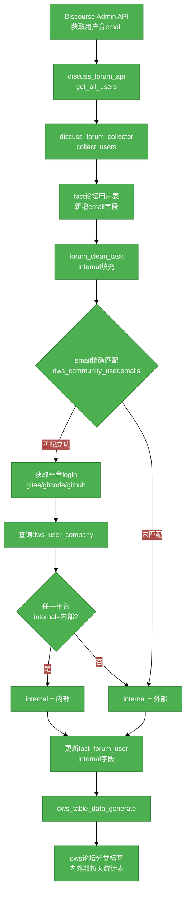
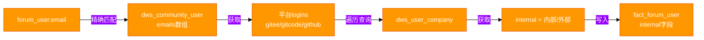

# #314 论坛用户内外部区分需求分析说明书

## 1. 基础信息

* **需求链接**: https://github.com/opensourceways/backlog/issues/314
* **需求名称**: 论坛用户内外部区分——采集用户邮箱并标识华为/非华为归属
* **开发责任人**: ssignik

---

## 2. 需求场景说明

**场景说明:**

当前 om-dataarts 系统已实现论坛数据（帖子、回复、分类、标签等）的采集和统计分析，但在分析论坛社区运营健康度时，无法区分帖子/回复来自华为内部用户还是外部社区用户。这导致：

1. **运营决策缺乏依据**：无法判断社区帖子是内部员工推动还是外部开发者真实参与
2. **响应质量难以评估**：无法区分首次回复来自内部还是外部，影响社区活跃度评估的准确性
3. **数据看板维度缺失**：现有 `dws_{community}_forum_category_tag_daily` 仅按分类+标签维度统计，缺少内外部维度

本需求通过以下链路实现论坛用户内外部区分：
- 采集论坛用户邮箱（通过 Discourse Admin API）
- 通过邮箱匹配 ONEID 用户体系，获取平台账号（Gitee/GitCode/GitHub login）
- 通过平台账号查询 `dws_{community}_user_company` 表获取 internal 标识
- 将 internal 字段写入 `fact_{community}_forum_user` 表
- 在 DWS 分析层新增内外部维度的统计表

## 3. 需求验收标准

**验收标准:**

- [ ] 调用 Discourse `/admin/users/list/all.json?show_emails=true` 接口，能够分页获取所有论坛用户信息（含 email）
- [ ] 用户数据（含 email 字段）正确写入 `fact_{community}_forum_user` 表
- [ ] 通过 email 精确匹配 `dws_community_user.emails`，获取用户的平台 login
- [ ] 通过平台 login 查询 `dws_{community}_user_company`，获取 internal 值
- [ ] `fact_{community}_forum_user` 表新增 `email` 和 `internal` 字段，internal 值正确填充（内部/外部）
- [ ] 无匹配时默认返回"外部"
- [ ] 任一平台 login 的 internal 为"内部"时，结果为"内部"
- [ ] 用户采集功能可通过 `service_platform_config` 配置开关（不是所有社区都支持 Admin API）
- [ ] 新增 `dws_{community}_forum_category_tag_internal_daily` 表，按日期+分类+标签+内外部维度统计
- [ ] DWS 生成通过 `dws_table_data_generate` 入口调用，可配置
- [ ] 执行链路清晰：forum_task(采集) → forum_clean_task(清洗) → dws_table_data_generate(聚合)

---

## 4. 需求设计与分解

### 4.1 核心逻辑方案

**逻辑方案:** 系统采用 fact → dwd → dws 三层数据架构：

1. **fact 层（采集）**：`forum_task` 中新增用户数据采集，通过 Discourse Admin API 获取含 email 的用户信息，写入 `fact_{community}_forum_user` 表（新增 email 字段）
2. **dwd 层（清洗）**：新增 `forum_clean_task`，通过 email 匹配 ONEID 用户体系获取 internal 标识，更新 `fact_{community}_forum_user.internal` 字段
3. **dws 层（聚合）**：通过 `dws_table_data_generate` 入口调用新的 DWS 生成逻辑，产出 `dws_{community}_forum_category_tag_internal_daily` 表

**流程图：**

**internal 填充匹配流程：**

### 4.2 任务清单

**任务清单:**

| 任务 ID | 任务描述 | 预期产出 | 预期工作量（人天） |
|---|---|---|---|
| **task1** | discuss_forum_api 新增 get_all_users() 方法，支持分页获取用户信息（含 email） | API 方法代码 + 单元测试 | 1 |
| **task2** | discuss_forum_collector 新增 collect_users() 方法，将用户数据写入数据库 | 采集逻辑代码 + 单元测试 | 1.5 |
| **task3** | fact_forum_user 表新增 email、internal 字段 | 表结构变更 + 迁移脚本 | 0.5 |
| **task4** | 新增 forum_clean_task，实现 internal 填充逻辑（email→dws_user→user_company） | 清洗任务代码 + 单元测试 | 2 |
| **task5** | service_platform_config 增加用户采集配置（collect_users 开关） | 配置逻辑 + 文档 | 0.5 |
| **task6** | 新增 dws_forum_category_tag_internal_daily 表定义及生成逻辑 | DWS 表 + 生成代码 + 单元测试 | 2 |
| **task7** | forum_task 集成用户采集调用，dws_table_data_generate 集成新 DWS | 任务编排代码 | 1 |
| **task8** | 端到端测试：采集→清洗→聚合全链路验证 | 集成测试 | 1.5 |

---

## 5. 需求相关性分析

### A. 安全相关性分析

* [ ] **边界变更**：新增公网端口、修改防火墙规则、变更网关配置。
* [ ] **凭证处理**：涉及密钥（Secret/Key）、Token、证书的存储或分发。
* [ ] **权限调整**：修改权限模型、服务账号（SA）权限或鉴权逻辑。
* [ ] **供应链**：引入新的第三方二进制文件、SDK 或重大版本依赖升级。
* [x] **隐私风险评估**：涉及用户个人数据（Email、手机号、IP、邮箱 等）的处理。_原因：采集并存储用户邮箱地址_
* [ ] **AI使用**：涉及AIGC能力应用，并提供服务。

### B. 架构设计相关性分析

* [ ] A环节判定需要完成安全设计
* [ ] 改变了现有系统的物理/逻辑拓扑
* [x] 新增或大幅修改对外暴露的 API/CLI 接口 _原因：新增对外部 Discourse Admin API 的调用（出站），且涉及新的数据处理链路_
* [ ] 引入了新的中间件、数据库或三方核心组件

### C. 系统集成测试相关性分析

* [ ] 上述环节判定需要执行安全设计或架构设计。
* [ ] **跨组件影响**：变更会触发下游服务或关联系统的连锁反应（级联效应）。
* [ ] **核心组件管控**：含项目定级为 Core 的核心逻辑变更。
* [ ] **环境强依赖**：功能高度依赖内核参数、网络拓扑或特定的物理挂载。
* [x] **端到端流程**：涉及从用户输入到持久化存储的全链路逻辑。_原因：采集→清洗→聚合全链路_

### D. 用户体验相关性分析

* [ ] **交互逻辑变更**：涉及 Web 门户、控制台（Dashboard）或命令行工具（CLI）的交互流程调整。
* [ ] **感知性能变动**：变更可能显著影响页面的加载时间、同步请求的响应时延或异步任务的进度反馈。
* [ ] **文档与辅助能力**：涉及报错提示语、帮助中心链接、FAQ 或新功能的 Runbook 说明。
* [ ] **无障碍与多语种**：涉及国际化（i18n）支持、辅助功能或不同终端（移动端/桌面端）的适配。

### 5.1 需求相关性分析汇总结果

* [x] need_security (需架构设计（含安全威胁分析和安全设计）)
* [x] need_design (需架构设计)
* [x] need_itest (需执行测试策略设计和全链路集成测试)
* [ ] need_ux (需架构设计（含UX设计)）
* [ ] need_light (上述均未勾选，走快速合入通道)

---

## 6. 价值识别与业务评估

| 维度 | 评估问题 | 结论/说明 |
|---|---|---|
| **范围判定** | 该需求是否属于基础设施范围内？ | 是，属于数据采集分析平台能力扩展 |
| **规划一致性** | 该需求是否在年度技术规划中？ | 是，社区运营数据精细化分析方向 |
| **优先级** | 该需求优先级评估（高/中/低）？ | 中 |
| **通用性** | 该需求是否解决 3 个以上业务方的共性痛点？ | 是，所有 discuss 类型论坛社区均需要内外部区分 |
| **必要性** | 现有组件通过配置变更是否无法实现目标？ | 是，现有系统无法区分论坛用户内外部归属 |
| **工作量** | 预计总工作量 | 10 人天 |
| **价值评估** | 实现后能减少多少手动操作或提升多少系统稳定性？ | 运营分析从"无法区分"到"自动化内外部区分"，消除手动标注工作量，提升社区运营数据可信度 |

**建议结论**：Accept

**原因描述:** 该需求填补了论坛用户内外部区分的能力空白，通过复用现有 ONEID 用户体系和 user_company 数据，无需人工标注即可自动判断用户归属，符合数据驱动的社区运营方向。
